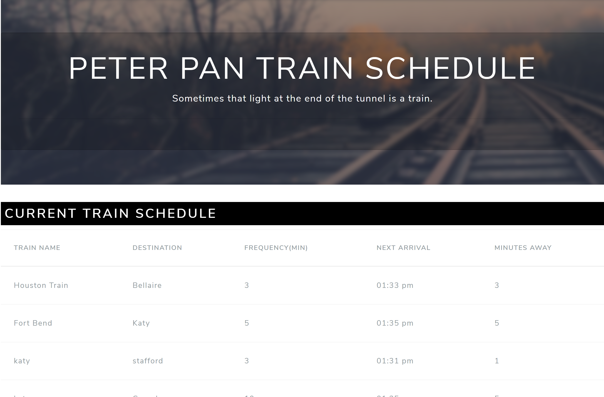

# Train_scheduler

### Overview

A train schedule application that incorporates Firebase to host arrival and departure data. app will retrieve and manipulate this information with Moment.js. This website will provide up-to-date information about various trains, namely their arrival times and how many minutes remain until they arrive at their station.

### How it works

- Application specs:

  - When adding trains, administrators will be able to submit the following:

    - Train Name

    - Destination

    - First Train Time -- in military time

    - Frequency -- in minutes

  - App calculates when the next train will arrive; it is relative to the current time.

  - Users from many different machines are able to view same train times.
